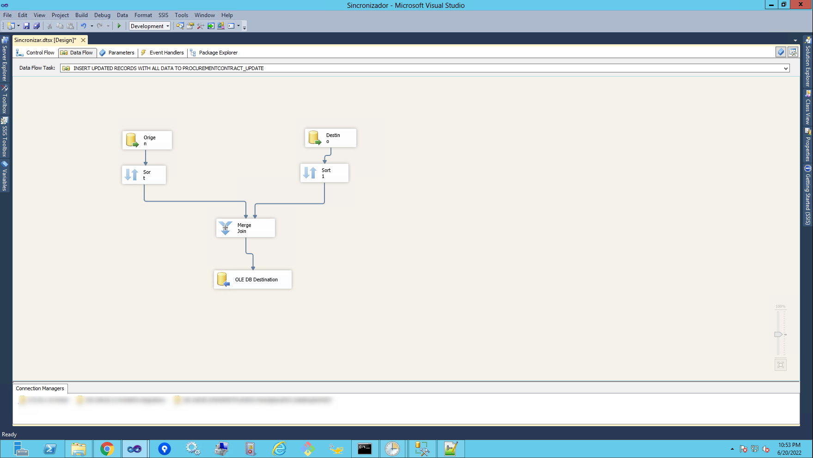

# Develop and maintain ETL - SQL Server Integration Services (SSIS)

The objective was to develop and maintain ETL Reports - SQL Server Integration Services (SSIS) according to the request of the head of the department.

Technology used:
**ETL - SQL Server Integration Services (SSIS)
MS Sql server, Mysql, T-SQL (Store procedure, functions, view, temporary tables, linked servers, etc)**

I have developed and maintained ETL - SQL Server Integration Services (SSIS) such as the following:

SSIS transfers data from the databases of the production environment to the databases of other internal environments, send information to FTP, among other types of ETLs.

##### Screenshots of the System

